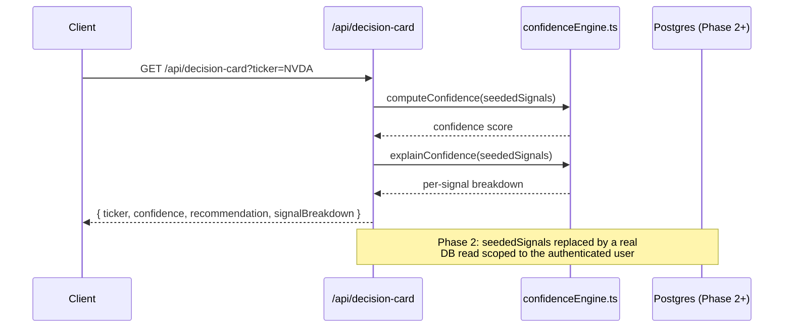

# API Diagram (Phase 1)

```mermaid
sequenceDiagram
    participant Client
    participant API as /api/decision-card
    participant CE as confidenceEngine.ts
    participant DB as Postgres (Phase 2+)

    Client->>API: GET /api/decision-card?ticker=NVDA
    API->>CE: computeConfidence(seededSignals)
    CE-->>API: confidence score
    API->>CE: explainConfidence(seededSignals)
    CE-->>API: per-signal breakdown
    API-->>Client: { ticker, confidence, recommendation, signalBreakdown }
    Note over API,DB: Phase 2: seededSignals replaced by a real<br/>DB read scoped to the authenticated user
```

Current implementation: `frontend/app/api/decision-card/route.ts`. The `TODO(integration)` comment there marks exactly the line that changes when real data lands.
