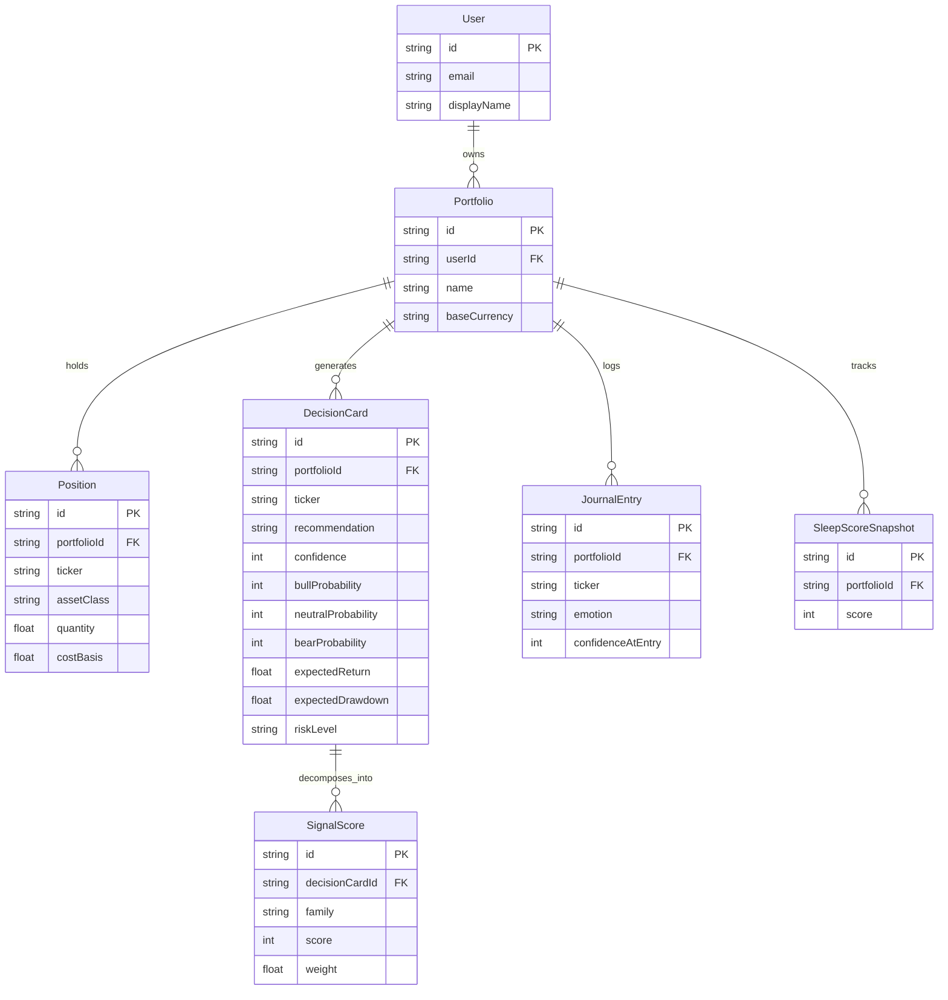

# Database ERD

```mermaid
erDiagram
    User ||--o{ Portfolio : owns
    Portfolio ||--o{ Position : holds
    Portfolio ||--o{ DecisionCard : generates
    Portfolio ||--o{ JournalEntry : logs
    Portfolio ||--o{ SleepScoreSnapshot : tracks
    DecisionCard ||--o{ SignalScore : decomposes_into

    User {
        string id PK
        string email
        string displayName
    }
    Portfolio {
        string id PK
        string userId FK
        string name
        string baseCurrency
    }
    Position {
        string id PK
        string portfolioId FK
        string ticker
        string assetClass
        float quantity
        float costBasis
    }
    DecisionCard {
        string id PK
        string portfolioId FK
        string ticker
        string recommendation
        int confidence
        int bullProbability
        int neutralProbability
        int bearProbability
        float expectedReturn
        float expectedDrawdown
        string riskLevel
    }
    SignalScore {
        string id PK
        string decisionCardId FK
        string family
        int score
        float weight
    }
    JournalEntry {
        string id PK
        string portfolioId FK
        string ticker
        string emotion
        int confidenceAtEntry
    }
    SleepScoreSnapshot {
        string id PK
        string portfolioId FK
        int score
    }
```

Full field list and rationale: `docs/Database.md`, `backend/prisma/schema.prisma`.
