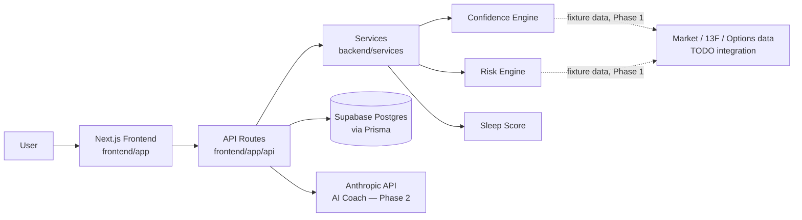

# System Diagram

```mermaid
flowchart LR
    U[User] --> FE[Next.js Frontend<br/>frontend/app]
    FE --> API[API Routes<br/>frontend/app/api]
    API --> SVC[Services<br/>backend/services]
    SVC --> CE[Confidence Engine]
    SVC --> RE[Risk Engine]
    SVC --> SS[Sleep Score]
    API --> DB[(Supabase Postgres<br/>via Prisma)]
    API --> AI[Anthropic API<br/>AI Coach — Phase 2]
    CE -.fixture data, Phase 1.-> EXT1[Market / 13F / Options data<br/>TODO integration]
    RE -.fixture data, Phase 1.-> EXT1
```

See `docs/Technical_Architecture.md` for the ADRs behind each boundary shown here.
