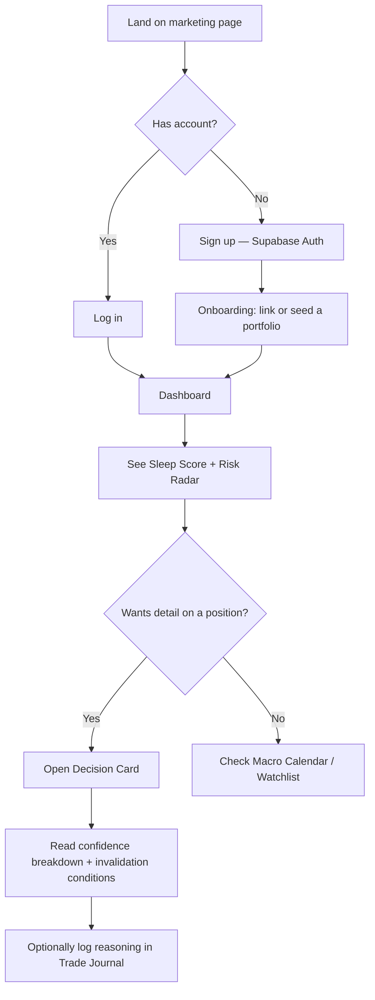

# User Flow — First Session

Phase 1 flow deliberately ends at "read and understand" (J/L), not "execute a trade" — see `docs/PRD.md` success metric: correct restatement of *why* a confidence number is what it is, not conversion to a transaction.
